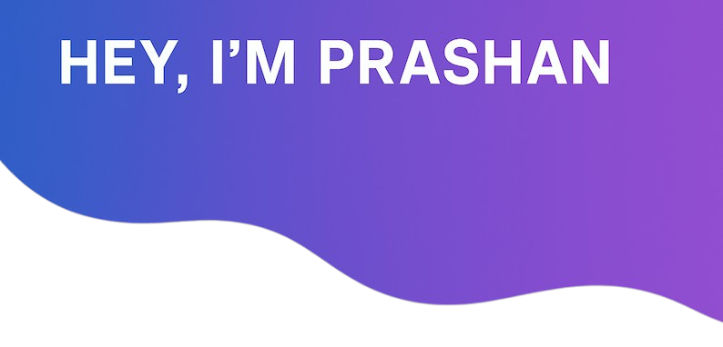

I'm a **Senior Software Engineer** at **Coforge** with a strong foundation in **Java** and hands-on experience with **Spring Boot**. I'm currently expanding my knowledge in **microservices architecture**, **system design**.

💡 Fast learner, problem solver, and passionate about backend technologies.  
🚀 Actively looking for **backend development opportunities** where I can contribute, grow, and build impactful systems.

---

### Let's Connect ☕  

	
	
  

    

